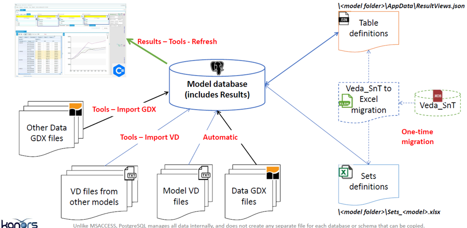
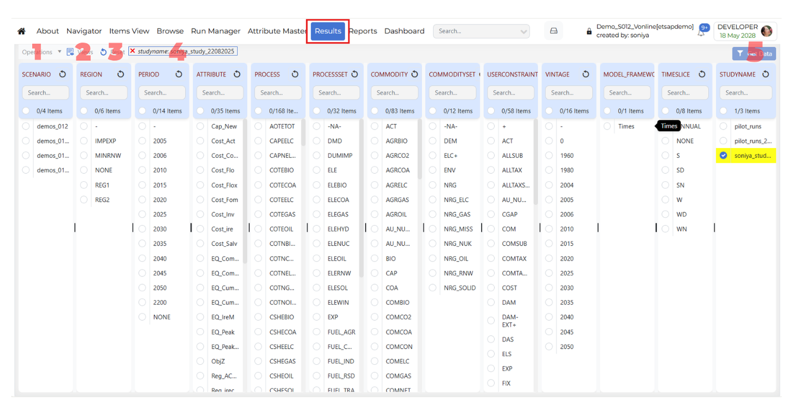
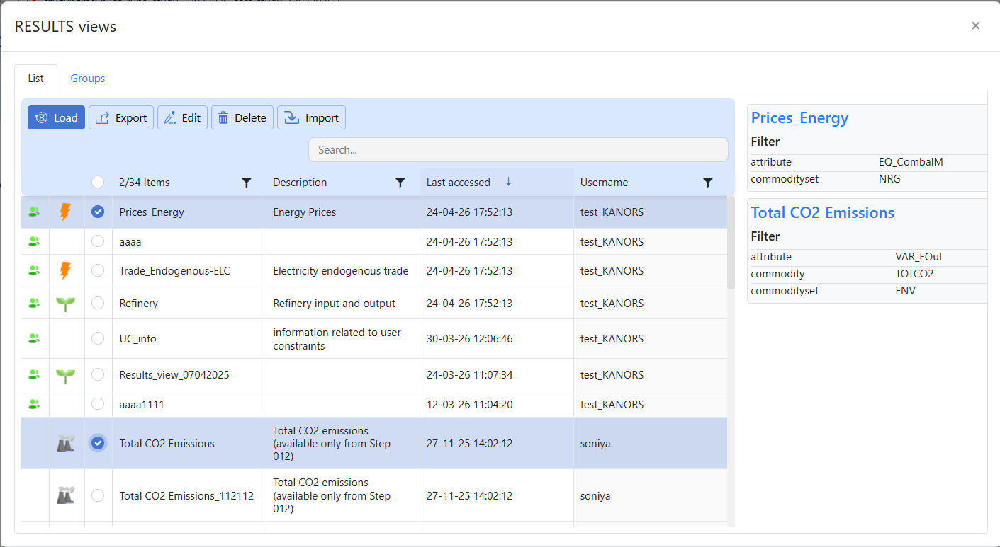

# Results

## Introduction

Used to analyse TIMES model results. Results are all stored in the model folder (e.g. DemoS_012) and belongs to that model

- Model VD files: model results (VD files) are included automatically in the model database at the end of a successful run (e.g. VedaGAMS_WrkTIMESDemoS_012).

- Results browsing: to view (and refresh) model results through dynamic pivot tables (cubes)

- Table definition: user defined tables for a specific model  
  (<model folder>/AppData/ResultsView.json)

- Batch export: to export results in excel and CSV.

## How to use it?

### 1. Operations

The **Operations** menu contains actions related to result processing and case management.

#### Process Results

**Process Results** reads the **VD files** and processes all cases for the current model.

#### Delete Cases

Delete the saved cases in the current model.

### 2. Views

- The **Views** option is used to manage saved views.
- Use **Views** to open the **Views** window and maintain saved configurations.
- Saved views help users quickly reuse previously defined layouts, filters, and analysis settings without repeating the full setup.

- The **Views** window contains two main sections:  
  1.  **Views List**: shows individual saved views and lets users load, edit, export, delete, or import them.
  2.  **Views Groups**: shows collections of saved views so related analyses can be organized together.

!!! note

    - Use **List** when you want to work on a specific saved view.
    - Use **Groups** when you want to manage related views as a collection.

- **Views List**  
  The **List** tab shows the available saved views. From this section, users can select a saved view and perform actions such as **Load**, **Export**, **Edit**, **Delete**, and **Import**.

    - **Load**  
    Use **Load** to open a previously saved view.

        - Click **Views**.
        - Stay on the **List** tab.
        - Select the required saved view.
        - Review the saved filter summary shown in the details panel.
        - Click **Load**.

    - **Export**  
      Use **Export** to export a saved view for download.

        - Click **Views**.
        - Stay on the **List** tab.
        - Select the required saved view.
        - Click **Export**.
        - Choose the required download format such as **CSV**.
        - Confirm the export action.
        - The exported file will be available in the **Jobs Dashboard**.

    - **Edit**  
      Use **Edit** to modify an existing saved view.

        - Click **Views**.
        - Stay on the **List** tab.
        - Select the required saved view.
        - Click **Edit**.
        - Change the required filters.
        - Click **Update Filters**.
        - Confirm the update.

    - **Delete**  
      Use **Delete** to remove a saved view.

        - Click **Views**.
        - Stay on the **List** tab.
        - Select the required saved view.
        - Click **Delete**.
        - Confirm the deletion, if prompted.

    - **Import**  
      Use **Import** to bring saved views from another model into the current model.

        - Click **Views**.
        - Stay on the **List** tab.
        - Select the required saved view.
        - Click **Import**.
        - Select the source model.
        - Review the available views.
        - Select the required view or views.
        - If needed, also select the required group of cases.
        - Confirm the import action.
        - Imported views will appear in the **Views List** with shared icon.
        - Imported groups will appear in the **Manage Cases** section of the **Run Manager**, marked with the shared icon.

- **Views Groups**  
  The **Groups** tab displays saved view groups, where available. This section is used to organize and manage views in grouped form.

!!! note

    - The right-side details panel helps users review saved filter information before loading, editing, exporting, or deleting a view.
    - Imported views behave like regular saved views after import.
    - Export runs as a background job, and files are downloaded from the **Jobs Dashboard**.
    - Use **Edit** to update an existing saved view, and **Load** to open it without making changes.
    - A collection of saved views is called a **group**.
    - The **Groups** tab is used to view and manage groups.
    - Groups help users organize related views for easier reuse.

### 3. Reset

The **Reset** option clears the current result selections and removes the applied filters from the page.

### 4. Global Filters

- The **Global Filters** default applies to the latest study.
- When a row in the Results grid is **highlighted in yellow**, it means that a global filter is applied to that row.
- Press the **Ctrl key** and click on the row to apply the filter to the row.

### 5. Get Data

The **Get Data** button retrieves data based on the selected global filters. Use it after selecting the required values in the filter panels.

When a user clicks **Get Data** [Pivot grid](../Pivot-grid.md).

### Right-click Functionality

The Results module includes right-click functionality for selected dimension items. This shortcut menu allows users to quickly open related actions for the selected item without changing the main Results workflow.

**Dimension-specific behavior**

The right-click menu is not the same for every dimension.

- For **PROCESS** and **COMMODITY** dimensions, the right-click menu includes the following options:  
    - Items View
    - Show Detail
    - ExRes

- For ALL other dimensions, the right-click menu includes the following option:  
    - Show Detail

- **Items View**: Opens the selected item in Items View modules.

- **Show Detail**: Opens an information dialog for the selected value (for example, `period - 2015 information` or `process - COTEELC information`).

- **Exes**:

!!! note

    Coming soon. This section will describe the <strong>Exes</strong> functionality in Results.
